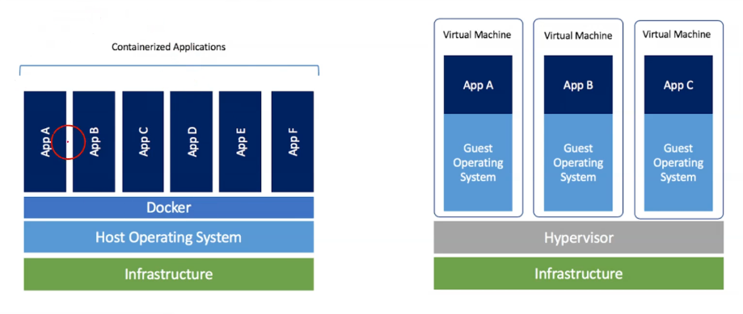
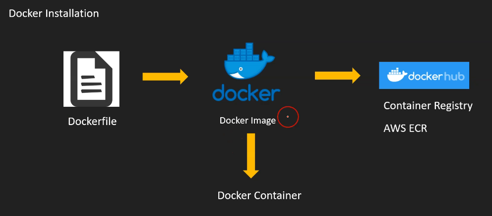

# Docker

- Docker is software development platform

- Here you packaged app in images

- **Container** use **image** to start application

- **Containers run on any operating system**

- It works exactly same **independent of OS, machine, Environment**

- **Lightweight compared to VM**

- **Easier to maintain & deploy**

- Docker works with any language, runtime, OS

# Docker vs VM

- Docker runs on a regular OS (host operating system), while a VM requires a hypervisor to run, which is similar to a large OS.

- Containerized applications each have their own independent kernel space, but unlike virtual machines, they do not have a full-fledged operating system, so they are lighter.

# Docker workflow

