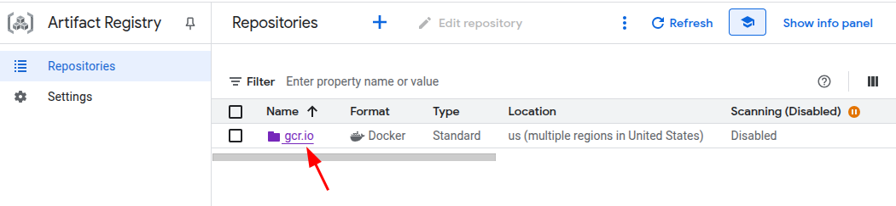
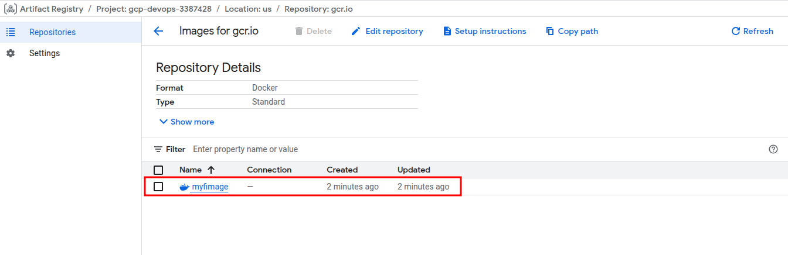

# Create Simple Webapp

1. Python based Web Application
    - main.py
        ```python
        from flask import Flask

        app = Flask(__name__)

        @app.route('/')
        def index():
            return "Hello, World!"

        if __name__ == '__main__':
            app.run(host='0.0.0.0', port=8080)
        ```
    - Dockerfile
        ```Dockerfile
        FROM python:3.7-slim # search on DockerHub official python repo, find the tag with correct version (the dev used one when developing) and slimmest one
        RUN pip install flask # install dependencies
        WORKDIR /myapp # set working directory for placing application code
        COPY main.py /myapp/main.py # copy application code from local to image
        CMD ["python", "/myapp/main.py"] # command to run the application
        ```

    You can write them locally and upload to Cloud Shell, or create them directly in Cloud Shell using `nano main.py` and `nano Dockerfile`.

2. build Docker images
    ```bash

    ❯ docker build -t gcr.io/gcp-devops-3387428/myfimage:v1.0 . # gcr.io means Google Container Registry (which we will push to later)
                                                                # then followed by project id / image name : tag
                                                                # this is convention for naming images which is required for pushing to Container Registry
    ❯ docker images
    # REPOSITORY                           TAG        IMAGE ID       CREATED          SIZE
    # gcr.io/gcp-devops-3387428/myfimage   v1.0       03b2bd5792a9   44 seconds ago   137MB
    ```

3. push to Container Registry
    1. enable Artifact Registry API
    2. active Artifact Registry (top-right corner)
    3. `docker push gcr.io/gcp-devops-3387428/myfimage:v1.0` in Cloud Shell, it will push the image to Artifact Registry automatically


    

    


