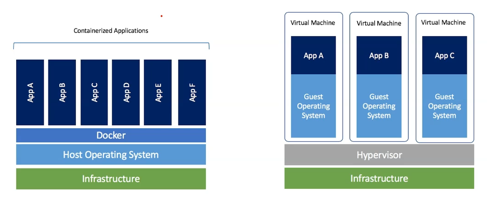

# Container Technology

## Software Shipping Technology

### Building JAVA APP Example

Container packages all the following components into a single image:

- **Java runtime (JRE)** - Java Runtime Environment
- **All library dependency** - All required library dependencies
- **Network configuration** - Network configuration settings
- **Runtime DLL** - Runtime Dynamic Link Libraries

### Core Concept

- **Combine all this thing into one single bucket & ship**
- **Deploy to multiple environments** - Can be deployed across different servers or environments

## Compare with OOP (Object-Oriented Programming)

### Analogy with OOP Concepts

- **Images** ≈ **Class (Blueprint)**
  - Images serve as templates for creating containers, similar to how classes serve as blueprints for objects
  
- **Container** ≈ **Objects**
  - Containers are instantiated from images, just like objects are instantiated from classes
  - One image can create multiple container instances

## Key Advantages

1. **Environment Consistency** - Ensures applications run consistently across different environments
2. **Simplified Deployment** - Packages all dependencies together, streamlining the deployment process
3. **Scalability** - Easy to deploy the same container across multiple servers
4. **Isolation** - Each container runs in its own isolated environment

# VM vs Containers

## Container Advantages

### Key Benefits of Containers

- **Containers are lightweight**
  - Minimal resource overhead compared to virtual machines
  
- **Easily portable to any public cloud, VM, bare metal**
  - Platform-agnostic deployment across different infrastructure types
  
- **For Micro service deployment, lightweight containers are preferred**
  - Ideal for microservices architecture due to their small footprint
  
- **Fast CI/CD cycle**
  - Enables rapid continuous integration and deployment processes
  
- **All major public cloud providers have services to deploy containers**
  - Universal support across cloud platforms

### Google Cloud Platform (GCP) Container Services

- **VM** - Virtual Machine instances
- **Cloud Run** - Serverless container platform
- **GKE** - Google Kubernetes Engine for container orchestration

## Architecture Comparison

