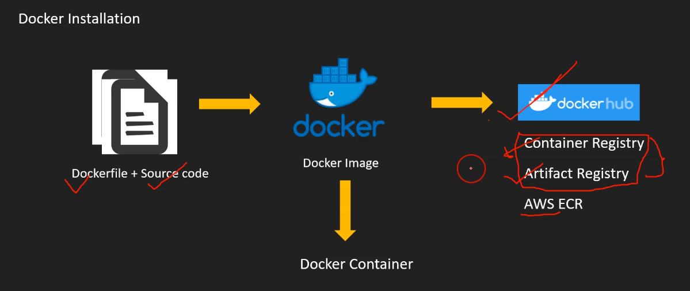

# Docker

## What is Docker?

**Container** is an **abstract concept**.

**Docker** is a **specific implementation** of the **Container concept**.

## Docker Core Concepts

### Images and Containers
- **Create Docker Images** - Package your application and its dependencies
- **From Images can create multiple containers** - One image serves as a template for many container instances
- **Here you packaged app in images** - The application and all its requirements are bundled into an image
- **Container use image to start application** - Containers are running instances created from images

## Key Advantages of Docker

### Cross-Platform Compatibility
- **Containers run on any operating system** - prefer Linux based
- **It works exactly same independent of OS, machine, Environment**
  - Consistent behavior across different platforms
  - No "it works on my machine" problems

### Efficiency and Performance
- **Lightweight compared to VM** - Minimal resource overhead
- **Easier to maintain & deploy** - Simplified deployment process

### Language and Runtime Agnostic
- **Docker works with any language, runtime, OS**
  - Supports all programming languages
  - Compatible with different runtime environments
  - Platform independent

## Docker Workflow

