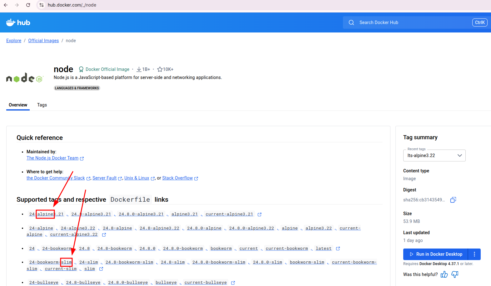

# Create First Docker Image

1. Create a directory with node.js application and Dockerfile inside it.

```js
// container/server.js
var http = require('http');
var handleRequest = function(req, res) {
  res.writeHead(200);
  res.end("<h1>Welcome to the Node.js Server!</h1>");
}
var www = http.createServer(handleRequest);
www.listen(8080);
```


```Dockerfile
FROM node # Use the official Node.js image from the Docker Hub
EXPOSE 8080
COPY server.js .
CMD node server.js
```

2. Upload the directory to Google Cloud Shell.


Then you should see the files in your Cloud Shell home directory.

```bash
mattchang210@cloudshell:~ (valiant-pager-466505-c7)$ ls
# container  Dockerfile  main.py  README-cloudshell.txt
mattchang210@cloudshell:~ (valiant-pager-466505-c7)$ cd container/
mattchang210@cloudshell:~/container (valiant-pager-466505-c7)$ ls
# Dockerfile  server.js
```


3. Activate node application directly in Cloud Shell to make sure it works.


4. If it works, stop the application by pressing `Ctrl + C`. And then build the Docker image.

```bash
mattchang210@cloudshell:~/container (valiant-pager-466505-c7)$ node server.js
^C # Stop the application by pressing Ctrl + C
mattchang210@cloudshell:~/container (valiant-pager-466505-c7)$ docker build -t myapp:v1.0 . # Build the Docker image
mattchang210@cloudshell:~/container (valiant-pager-466505-c7)$ docker images # List the Docker images
# REPOSITORY   TAG       IMAGE ID       CREATED              SIZE
# myapp        v1.0      a85cdbe4063a   About a minute ago   1.14GB
#                                                            ^^^^^^ # This is a big image because it includes the whole Node.js runtime environment
#                                                                   # You can use a smaller base image like 'node:alpine' to reduce the size
```

5. Check the DockerHub official Node.js page for smaller images.



6. Clear the previous Docker image.

```bash
mattchang210@cloudshell:~/container$ docker images
# REPOSITORY   TAG       IMAGE ID       CREATED         SIZE
# myapp        v1.0      4b7a8d7e3416   6 seconds ago   1.14GB
mattchang210@cloudshell:~/container$ docker rmi image 4b7a8d7e3416
# Untagged: myapp:v1.0
# Deleted: sha256:4b7a8d7e3416fba774dc4aab46565a527a23ab1dec86d49bac08253d022f6842
```

7. Modify the Dockerfile to use a smaller base image.

```Dockerfile
FROM node:24-alpine3.21 # Use a smaller Node.js image based on Alpine Linux
EXPOSE 8080
COPY server.js .
CMD node server.js
```

8. Rebuild the Docker image.

```bash
mattchang210@cloudshell:~/container$ docker build -t myapp:v1.0 .
mattchang210@cloudshell:~/container$ docker images
# REPOSITORY   TAG       IMAGE ID       CREATED         SIZE
# myapp        v1.0      fc3a42061444   2 minutes ago   167MB
#                                                       ^^^^^ # The image size is significantly reduced
```

9. Run the Docker container.

```bash
mattchang210@cloudshell:~/container$ docker run -d -p 8080:8080 --rm myapp:v1.0
# 5398a3a382a05fae21dd7587d88fc5b11dc00d54e47442764fe0879350ef70e7
mattchang210@cloudshell:~/container$ docker ps
# CONTAINER ID   IMAGE        COMMAND                  CREATED         STATUS         PORTS                    NAMES
# 5398a3a382a0   myapp:v1.0   "docker-entrypoint.s…"   4 seconds ago   Up 4 seconds   0.0.0.0:8080->8080/tcp   frosty_wu
```

10. Click the Web Preview button in Cloud Shell and select `Preview on port 8080`.


11: Stop the Docker container.

```bash
mattchang210@cloudshell:~/container$ docker ps # check the running containers
# CONTAINER ID   IMAGE        COMMAND                  CREATED         STATUS         PORTS                    NAMES
# 5398a3a382a0   myapp:v1.0   "docker-entrypoint.s…"   2 minutes ago   Up 2 minutes   0.0.0.0:8080->8080/tcp   frosty_wu
mattchang210@cloudshell:~/container$ docker stop 5398a3a382a0 # stop the container using its ID
# 5398a3a382a0
mattchang210@cloudshell:~/container$ docker ps -a # check all containers (including stopped ones)
CONTAINER ID   IMAGE     COMMAND   CREATED   STATUS    PORTS     NAMES
# No containers, because we used --rm option to remove the container after stopping it
```


