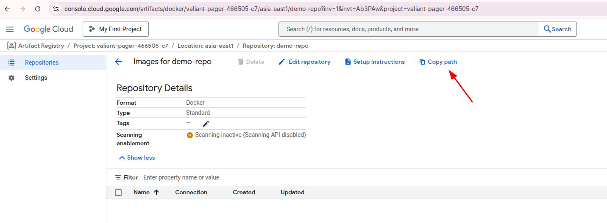

# Artifact Registry

- Artifact Registry comes with fine-grained access control via **Cloud IAM**

    

- Multiple Repository per project

- Regional & Multi-region repositories

- It can store not just **Docker** image but many more thing like NPM, maven, Python

    
    

- asia-southeast1-docker.pkg.dev/[ProjectID]/[repo]/nginx:v1.0

    
      `asia-east1-docker.pkg.dev/valiant-pager-466505-c7/demo-repo`

